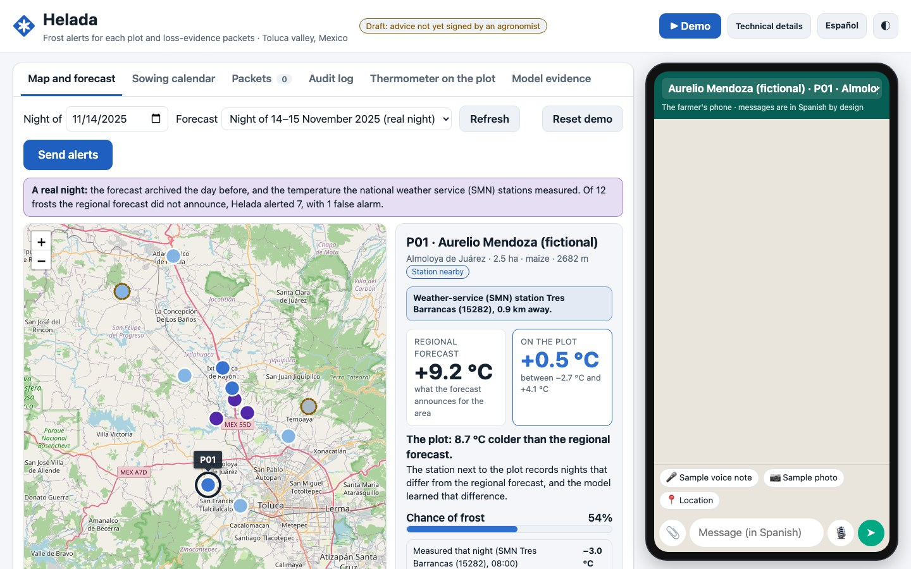
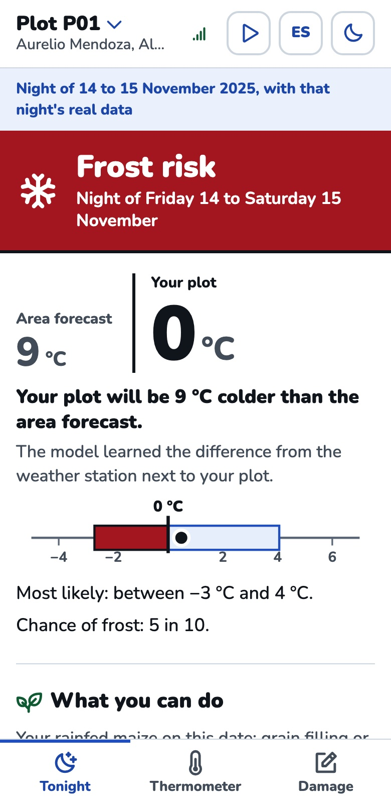
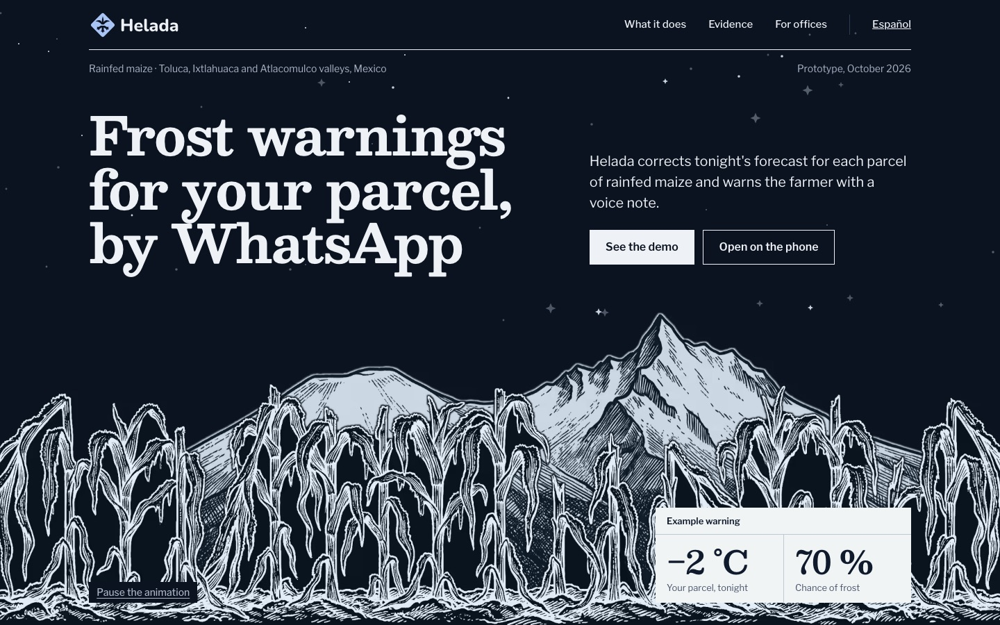
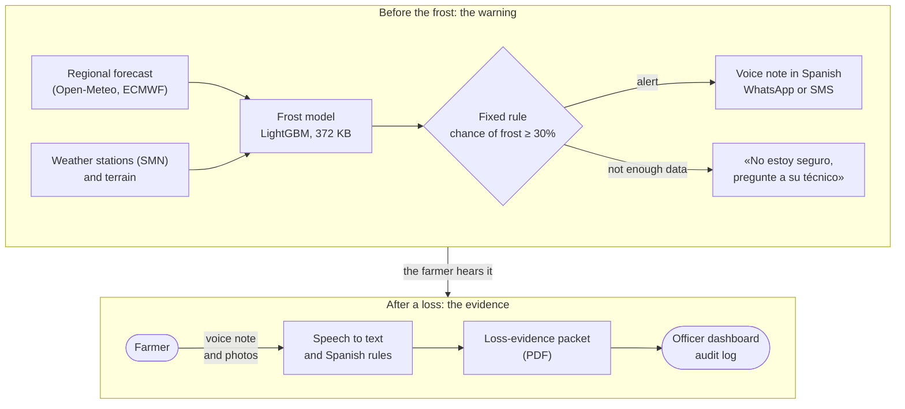
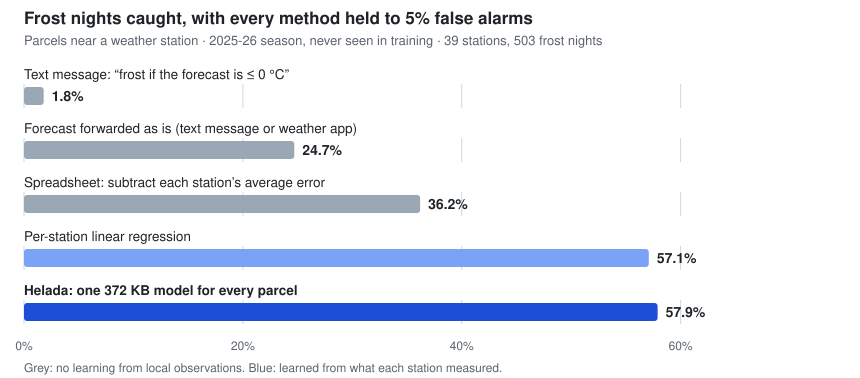
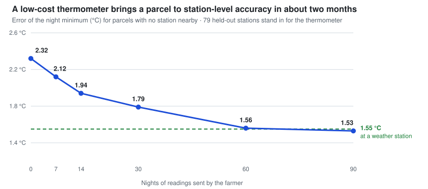
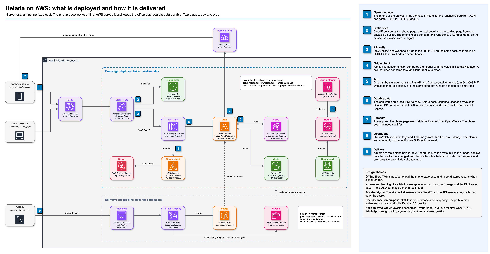
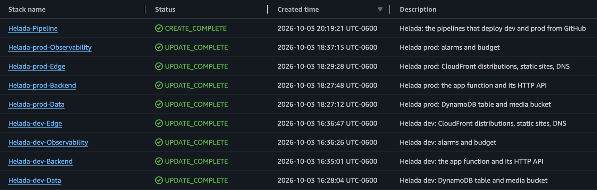
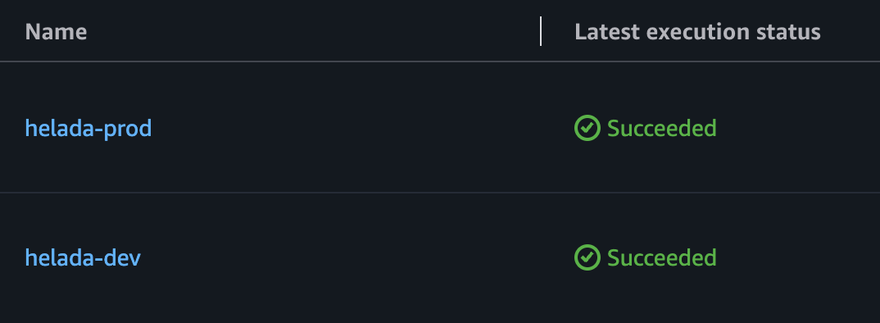
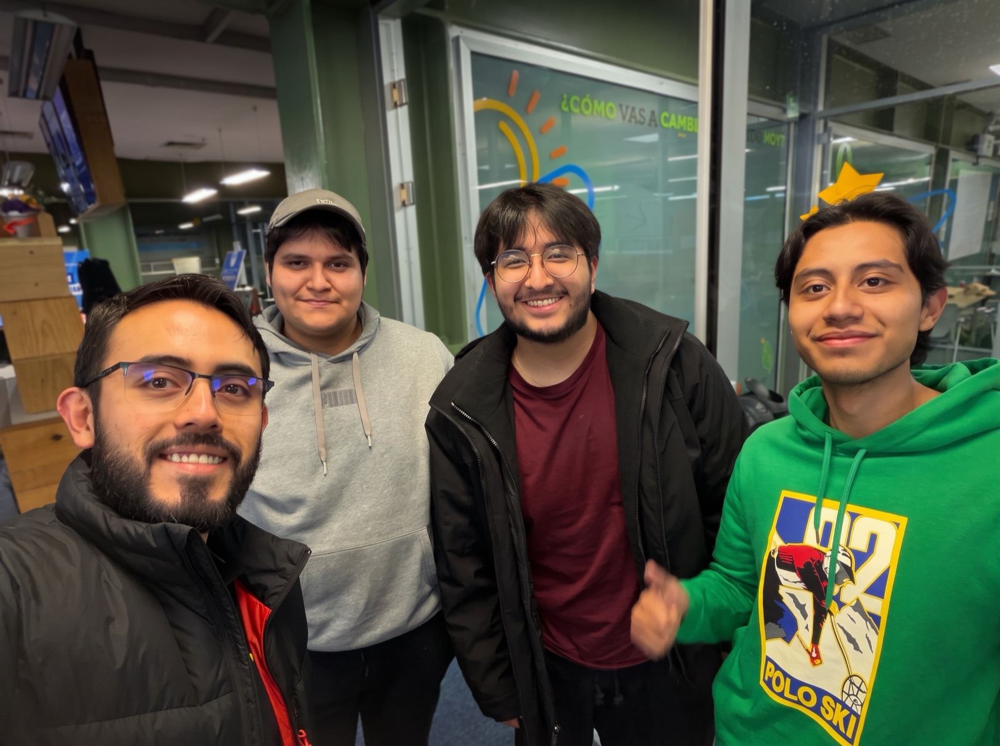

<div align="center">

<picture>
  <source media="(prefers-color-scheme: dark)" srcset="docs/img/helada-horizontal-dark.svg">
  
</picture>

### Frost warnings for each maize parcel, and loss-evidence packets, by WhatsApp

A 372 KB frost model that also runs on the farmer's phone with no signal.<br>
Built for smallholders who grow rainfed maize in Mexico's Toluca valley.

[](LICENSE)


**[Landing page](https://helada.app)** · **[Phone app](https://m.helada.app/#demo)** · **[Officer dashboard](https://panel.helada.app)**

**Testing from the Tecnológico de Monterrey network?** The links above are blocked there. Use these instead:<br>
[Landing page](https://d2x9irknqybt6f.cloudfront.net) · [Phone app](https://d39rr4bsfjtup0.cloudfront.net/#demo) · [Officer dashboard](https://doxd20937ve9e.cloudfront.net) · [why](#live)

</div>

> [!NOTE]
> World Bank *Small AI for Development* challenge (Hack-Nation, 3–4 October 2026), Agriculture sector. Team SysCallOx4.
> Every name and phone number in the demo is fictional. The weather data and the backtest are real.

| Officer dashboard | Phone app (works offline) |
|---|---|
|  |  |

<details>
<summary><b>Landing page</b></summary>
<br>

</details>

## Contents

- [The problem and the user](#the-problem-and-the-user)
- [What Helada does](#what-helada-does)
- [How it works](#how-it-works)
- [How it answers the challenge](#how-it-answers-the-challenge)
- [Try it](#try-it)
- [Results](#results)
- [Small AI: what runs where](#small-ai-what-runs-where)
- [Architecture on AWS](#architecture-on-aws)
- [Repository map](#repository-map)
- [Data](#data)
- [Responsible AI](#responsible-ai)
- [Limits and next step](#limits-and-next-step)
- [Documentation](#documentation)
- [Team](#team)
- [License and attribution](#license-and-attribution)

## The problem and the user

**The user** is a smallholder growing rainfed maize on up to 3 ha in the Toluca, Ixtlahuaca and Atlacomulco valleys (Estado de México). They often share an Android phone and use WhatsApp.

- The valley sees more than 100 frost days a year. In 2019, frost took 3,511 ha of rainfed maize in the Toluca district.
- The free regional forecast runs about 1.5 °C warm at weather stations, and it catches only one frost night in four.
- After a loss, the state crop-loss program (PASACME) gives 10 calendar days to report it, and then verifies the damage on site.

Sources for every figure: [`docs/problem-evidence.md`](docs/problem-evidence.md).

## What Helada does

1. **Frost warning.** A small model corrects tonight's forecast for each parcel, using what weather stations have observed, and gives a calibrated chance of frost. The farmer hears it as a Spanish **WhatsApp voice note** between 18:00 and 20:00, at most twice a week.
2. **The same model on the phone, with no signal.** An installable page runs the model on the device and keeps readings and reports until the signal returns.
3. **Planting calendar.** Each parcel's own frost dates help choose the sowing date and the variety's cycle. For maize in flower, a warning that evening rarely saves the crop, and Helada says so.
4. **Loss packet.** A voice note and photos become a PDF with the parcel, date, location, modelled and observed temperature, photo checks and the program's checklist. It says only "Documentos completos" (complete), "Falta: X" (missing: X) or "Confirmar: X" (to confirm, when an answer was unclear).

> [!IMPORTANT]
> Helada never decides eligibility. The state's Secretaría del Campo (agriculture ministry) decides every claim, on site.

## How it works



- The model only estimates temperature and the chance of frost. **Rules written as code** decide when an alert goes out, how often, and what the packet says.
- When the data is not enough, the answer is «No estoy seguro, pregunte a su técnico» (I'm not sure, ask your technician), with a phone number and no temperature.
- Every alert, message and packet is written to an append-only, hash-chained audit log.

Interfaces and the fixed rules: [`docs/interfaces.md`](docs/interfaces.md).

## How it answers the challenge

| The challenge asks for | What we built | Where to look |
|---|---|---|
| **Small AI** that runs on little hardware | A 372 KB frost model (LightGBM) and Whisper `small` on a CPU. No LLM runs by default | [`model/`](model/README.md), [`docs/small-ai-bench.md`](docs/small-ai-bench.md) |
| **Works with poor connectivity** | The model is ported to JavaScript and runs on the phone with no signal. The server repeats its saved forecast when it is offline | [`app/static/movil/`](app/static/movil), [`app/README.md`](app/README.md#phone-page-the-model-on-the-farmers-device) |
| **Why AI, and not something simpler** | Forwarding the forecast catches 24% of frost nights, a per-station average correction 36%, Helada 58%, at the same false-alarm rate. Where rules beat AI (reading a damage report), we use rules | [`docs/why-ai.md`](docs/why-ai.md) |
| **A fail-safe when the model is unsure** | «No estoy seguro, pregunte a su técnico», with no number, when there is no forecast, it is old, inputs are missing, or no station is near on a cold night | [`app/backend/alerts.py`](app/backend/alerts.py), [`docs/responsible-ai.md`](docs/responsible-ai.md) |
| **A person decides** | The farmer acts on the alert, the technician takes the unsure cases, the ministry decides every claim, an agronomist signs the advice table | [`docs/responsible-ai.md`](docs/responsible-ai.md) |
| **Development relevance** | A real program with a 10-day reporting clock, a named user, and measured frost losses | [`docs/problem-evidence.md`](docs/problem-evidence.md), [`docs/pasacme.md`](docs/pasacme.md) |
| **Design and inclusion** | Voice first, Spanish, works on a shared Android phone and by SMS on a basic one. One word («BAJA») stops the alerts | [`docs/tradeoffs-preconditions.md`](docs/tradeoffs-preconditions.md) |
| **Honest trade-offs and preconditions** | Skill is claimed only near weather stations. Elsewhere, low-cost thermometers on about 5 parcels per community are the stated precondition | [`docs/tradeoffs-preconditions.md`](docs/tradeoffs-preconditions.md), [Limits](#limits-and-next-step) |
| **Data transparency** | Every dataset with its source, license, size and what it does not cover | [`docs/data-sources.md`](docs/data-sources.md) |
| **Scale and replication** | The same pipeline runs for potato in Puno, Peru, from one config file, with no skill claim there | [`docs/scalability.md`](docs/scalability.md), [`docs/country-swap.md`](docs/country-swap.md) |

## Try it

### Live

| | Address | What to do |
|---|---|---|
| Landing page | <https://helada.app> | Read what it is, in Spanish or English |
| Phone app | <https://m.helada.app/#demo> | Opens the replay night of 14 November 2025. The play button walks through it. Install it and switch the signal off: it still answers |
| Officer dashboard | <https://panel.helada.app> | Press <kbd>▶ Demo</kbd> for the guided run, or follow the steps below by hand |

> [!NOTE]
> The live dashboard has no sign-in and uses a simulated phone, so anyone with the link can press the buttons, including the reset. No WhatsApp account is involved.

> [!WARNING]
> **On the Tecnológico de Monterrey network** the addresses above do not load. The campus web filter lists the new `helada.app` domain as "parked" and blocks it (seen at Campus Toluca on 4 October 2026). The same three sites answer on their CloudFront addresses, which the filter lets through:
>
> | | Address on the Tec network |
> |---|---|
> | Landing page | <https://d2x9irknqybt6f.cloudfront.net> |
> | Phone app | <https://d39rr4bsfjtup0.cloudfront.net/#demo> |
> | Officer dashboard | <https://doxd20937ve9e.cloudfront.net> |
>
> Open each address directly: the two buttons on the landing page still point to `helada.app`. Mobile data or any other network also works.

### On your machine

```sh
cd app
uv sync
uv run uvicorn backend.main:app --port 8000
```

1. Open <http://localhost:8000>. The dashboard opens in English; the <kbd>Español</kbd> button switches it. What the farmer receives (alerts, voice notes, the SMS, the PDF) is in Spanish in both.
2. In **Forecast**, choose **Night of 14–15 November 2025 (real night)**. This replays a real night with a model trained without that season.
3. Press <kbd>Send alerts</kbd>. The built-in phone simulator gets the alert with its voice note (recorded ahead for this night, see the note on voice under [Small AI](#small-ai-what-runs-where)).
4. Reply with the sample voice note and photos to get a packet.
5. Press <kbd>Reset demo</kbd> to start again. It clears alerts, chats, reports and packets; the audit log is kept.

No Twilio account or network is needed. Live forecasts use Open-Meteo when there is a connection.

<details>
<summary><b>Phone app, tests, container image, country swap</b></summary>

| What | Command |
|---|---|
| Phone app (offline model) | Open `/movil`, or `/static/movil/index.html#demo` for the replay night |
| App tests (2,216, offline) | `cd app && uv run pytest -q` |
| Model tests (33) | `cd model && uv run pytest -q` |
| Infrastructure tests (25) | `cd infra && npm ci && npm test` |
| Container image | `docker build -t helada . && docker run --rm -p 8080:80 helada` |
| Country swap (Puno, Peru) | `cd model && uv run python -m helada_model.regions.demo puno --date 2025-01-13` |

</details>

## Results

Each method's alert threshold is set so that 5% of frost-free nights get an alert; then we count the frost nights caught. Confidence intervals and reliability tables: [`model/README.md`](model/README.md).

| Where | Night minimum error: forecast → Helada | Frost nights caught at 5% false alarms |
|---|---|---|
| **Parcel near a weather station.** 2025-26 season, never seen in training; 39 stations, 5,855 station-nights, 503 with frost | 2.65 → **1.40 °C** (Open-Meteo default); 3.00 → 1.40 °C (raw ECMWF) | 24.3% → **57.9%** (default); 24.7% → 57.9% (raw ECMWF) |
| **Parcel with no station nearby.** 80 held-out stations, 2024-25 and 2025-26, 19,592 station-nights | 2.83 → 2.32 °C (default); 3.13 → 2.32 °C (raw ECMWF) | 32.1% → 32.4% (default); 23.4% → 32.4% (raw ECMWF) |

<picture>
  <source media="(prefers-color-scheme: dark)" srcset="docs/img/chart-frost-nights-caught-dark.svg">
  
</picture>

The bars use raw ECMWF as the forecast, the model's own input. A per-station regression does as well near stations; Helada ships one model instead because it also serves parcels with no station, takes a parcel's own readings, gives a calibrated chance with a range, and runs on the phone ([`docs/why-ai.md`](docs/why-ai.md)).

- **Near a station**, the model adds real skill.
- **Away from a station**, it removes the warm bias and shows a wider range, but it does not detect frost better than the default forecast.
- **The alert rule** (chance of frost ≥ 30%) fired on about 7 of every 100 station-nights in the backtest, catching 49% of frost nights at 3.5% false alarms near stations.

> [!WARNING]
> The skill claim holds only near SMN weather stations. On 79 held-out stations, about two months of nightly readings from a low-cost thermometer bring a parcel's error from 2.32 to 1.56 °C, the station level. Better frost detection needed a full season of readings.

<picture>
  <source media="(prefers-color-scheme: dark)" srcset="docs/img/chart-thermometer-curve-dark.svg">
  
</picture>

## Small AI: what runs where

| Piece | What | Size | Where it runs |
|---|---|---|---|
| Frost model | LightGBM, two regimes (near a station, terrain only), empirical calibration | **372 KB** | Server (Python) and phone (JavaScript port, matched on 204 cases to within 0.005 °C) |
| Terrain | Copernicus GLO-30 elevation, 12 features, averaged to about 180 m | 865 KB | Server, offline |
| Speech to text | faster-whisper `small`, int8, CPU | 486 MB | Server |
| Reading a damage report | Fixed Spanish rules. An optional `qwen3:1.7b` may only suggest a crop or cause | 30 KB (+1.4 GB if the LLM is on) | Server |
| Backend | FastAPI, SQLite, hash-chained audit log, PDF packets | — | A laptop, a Raspberry Pi class box, or AWS Lambda |
| Channel | WhatsApp through Twilio (sandbox), SMS fallback, built-in phone simulator | — | — |
| Phone app | Installable offline page (service worker) | about 1 MB | The farmer's Android phone |

Speech latency (about 1.1 s per voice note) was measured on a laptop CPU. A Raspberry Pi run has not been measured.

> [!NOTE]
> **About the voice you hear in the demo.** The box speaks with Piper, offline. Its Mexican Spanish voices sound synthetic, so the voice notes of the replay night (six alerts, one sowing answer and the farmer's sample) were recorded ahead with two ElevenLabs library voices and ship as audio files in [`app/backend/data/voice/`](app/backend/data/voice). Nothing calls ElevenLabs when the app runs; any other night, or a changed wording, is spoken by Piper.

## Architecture on AWS

The same code that runs on a laptop is deployed serverless, as two stages (`dev` and `prod`), by one pipeline. It costs about 1 to 2 USD per stage a month at demo traffic (estimate).



- **Static sites** (landing, phone app, dashboard): one private S3 bucket behind CloudFront.
- **App**: one Lambda function from a container image (FastAPI through the Lambda Web Adapter, arm64), behind an HTTP API that only CloudFront can call.
- **Durable data**: every row goes to DynamoDB and every media file to S3 before a response is sent; a new instance loads them back.
- **Delivery**: a merge to `main` deploys to `dev`; production starts only on request, for a commit `dev` already runs.

Both stages as they stand in the AWS account (console captures, 4 October 2026): nine CloudFormation stacks, four for each stage and one for the pipelines, and the two pipelines with their latest run.





Design, limits and cost: [`docs/aws-architecture.md`](docs/aws-architecture.md). Commands: [`infra/README.md`](infra/README.md). The diagram's source is [`docs/helada-aws-architecture.drawio`](docs/helada-aws-architecture.drawio).

## Repository map

| Path | What |
|---|---|
| [`model/`](model/README.md) | `helada_model`: features, training and research scripts, model files, backtest, the Puno region config |
| [`app/backend/`](app/README.md) | FastAPI backend: alert rule, WhatsApp/SMS/simulator channels, speech to text, damage-report rules, loss packet PDF, planting calendar, audit log |
| [`app/static/`](app/static) | Officer dashboard (plain HTML, CSS and JavaScript, English and Spanish) |
| [`app/static/movil/`](app/static/movil) | **Phone app**: installable offline page with the model in JavaScript |
| [`app/tests/`](app/tests), [`evals/`](evals/README.md) | Test suite, and the message sets the Spanish rules are checked against |
| [`landing/`](landing) | **Landing page** published at helada.app |
| [`infra/`](infra/README.md) | **AWS CDK**: data, backend, edge and observability stacks, and the deploy pipeline |
| [`Dockerfile`](Dockerfile), [`Dockerfile.aws`](Dockerfile.aws) | The app as one container image: for any single host, and for AWS Lambda |
| [`data/`](data) | Cached public data (station tables, elevation) |
| [`docs/`](#documentation) | Evidence, data, design decisions, architecture |

## Data

[`docs/data-sources.md`](docs/data-sources.md) lists every dataset with its source, license, size and **what it does not cover**.

| Data | What it gives | What it does not cover |
|---|---|---|
| SMN/CONAGUA daily station records (186 stations, public) | The night minimum the model learns from and is tested on | Parcels far from a station |
| Open-Meteo archived forecasts (`ecmwf_ifs025`, CC BY 4.0) | What the forecast said the day before | Only two frost seasons exist (2024-25, 2025-26) |
| Copernicus GLO-30 elevation | Terrain for any parcel, offline | It explained little of the error |
| ERA5 reanalysis (CC BY 4.0) | A range for the Puno example | Not an observation: no skill claim |
| 12 test voice notes | A speech benchmark | **Synthetic voices**, not farmers |

## Responsible AI

Full account, with what is built and what is missing: [`docs/responsible-ai.md`](docs/responsible-ai.md).

- **A person decides at every step.** The farmer decides what to do with an alert. The technician gets the case when the answer is "I'm not sure". The ministry decides every claim on site. An agronomist must sign the advice table; until then it shows "Borrador sin firma" (unsigned draft).
- **Data stays on the office's own box** (or in its own cloud account, in the hosted demo). Only WhatsApp messages, and parcel coordinates sent to the forecast service, leave it. No ID numbers or program folios are collected.
- **Consent.** One word («BAJA») stops every alert and is logged.
- **Bias.** Skill is measured near weather stations. Speech was tested on synthetic voices only.
- **Language.** Spanish by voice and text. Mazahua is not supported yet; the plan starts with phrases recorded by native speakers.

<details>
<summary><b>Not built yet</b></summary>

- a consent step at enrollment;
- deletion on request;
- a dashboard sign-in;
- one phone pack per farmer (the demo pack carries the whole fictional roster).

</details>

## Limits and next step

- The skill claim holds only near SMN stations.
- Only two frost seasons of forecast archive exist.
- The ground truth is air temperature in a weather shelter, not the crop.
- Speech accuracy is unmeasured on real farmers.
- Mazahua is not supported.
- The advice table is unsigned.
- WhatsApp Business sending is untested on a live account.
- Press reports say PASACME will rise to MX$5,000 per ha and 4 ha in 2026. No new rules are published, so the packet uses the 2024 rules ([`docs/pasacme.md`](docs/pasacme.md)).

**Next step:** one community for one frost season, with 5 thermometers (about MX$3,300), a consented roster, an agronomist's signature, and an agreement with the Secretaría del Campo on receiving digital packets.

## Documentation

| Topic | Document |
|---|---|
| The problem, with sources | [`docs/problem-evidence.md`](docs/problem-evidence.md) |
| Why AI, compared with simpler options | [`docs/why-ai.md`](docs/why-ai.md) |
| Model, backtest and logger learning curve | [`model/README.md`](model/README.md) |
| Speech and small-model benchmark | [`docs/small-ai-bench.md`](docs/small-ai-bench.md) |
| Datasets and their gaps | [`docs/data-sources.md`](docs/data-sources.md) |
| Responsible AI | [`docs/responsible-ai.md`](docs/responsible-ai.md) |
| Trade-offs, preconditions, costs | [`docs/tradeoffs-preconditions.md`](docs/tradeoffs-preconditions.md) |
| Scaling and the Puno country swap | [`docs/scalability.md`](docs/scalability.md), [`docs/country-swap.md`](docs/country-swap.md) |
| The crop-loss program's rules | [`docs/pasacme.md`](docs/pasacme.md) |
| The advice table an agronomist signs | [`docs/advisory-table.md`](docs/advisory-table.md) |
| Interfaces and fixed rules | [`docs/interfaces.md`](docs/interfaces.md) |
| AWS architecture and deployment | [`docs/aws-architecture.md`](docs/aws-architecture.md), [`infra/README.md`](infra/README.md) |
| App: demo steps, settings, how it works | [`app/README.md`](app/README.md) |

## Team



Team SysCallOx4: Daniel Fragoso, René Cano, Erick Jimenez and Alejandro Cruz, at the Tecnológico de Monterrey Campus Toluca hub.

## License and attribution

- **Code:** MIT ([`LICENSE`](LICENSE)).
- **Data:** SMN/CONAGUA daily climatology; Open-Meteo forecasts and ERA5 (CC BY 4.0, Copernicus); Copernicus DEM GLO-30 (© DLR e.V. 2010–2014 and © Airbus Defence and Space GmbH 2014–2018, provided under COPERNICUS by the European Union and ESA).
- **Voices and fonts:** demo voice notes recorded with ElevenLabs (library voices "Gabriela" and "Mem"); Piper voices `es_MX-claude-high` (Apache-2.0) and `es_MX-ald-medium` (Unlicense); Nunito (OFL); Phosphor icons (MIT); Leaflet (BSD-2-Clause).
- **Demo data:** producer names and phones are fictional; parcel coordinates are real points near SMN stations.
